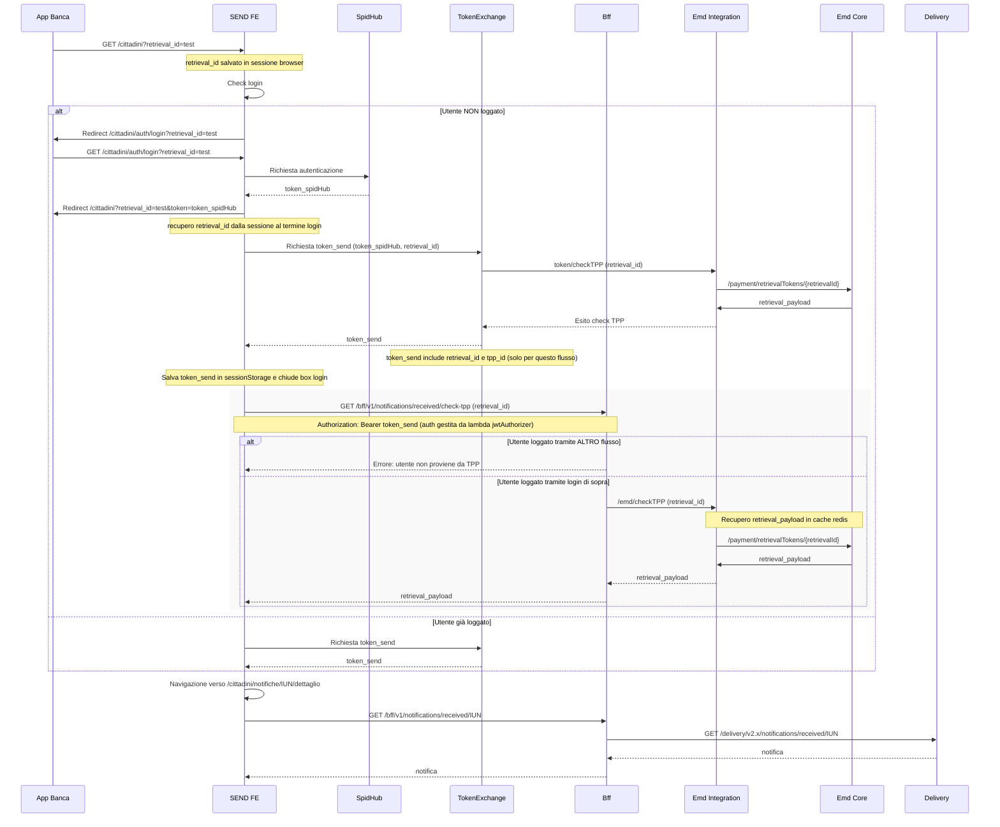

```mermaid
sequenceDiagram
    %% Partecipanti principali
    participant App Banca
    participant SEND FE
    participant SpidHub
    participant TokenExchange
    participant Bff
    participant Emd Integration
    participant Emd Core
    participant Delivery

    %% Accesso iniziale con retrieval_id
    App Banca->>SEND FE: GET /cittadini?retrieval_id=test
    Note over SEND FE: retrieval_id salvato in sessione browser
    SEND FE->>SEND FE: Check login

    alt Utente NON loggato
        SEND FE->>App Banca: Redirect /cittadini/auth/login?retrieval_id=test
        App Banca->>SEND FE: GET /cittadini/auth/login?retrieval_id=test
        SEND FE->>SpidHub: Richiesta autenticazione
        SpidHub-->>SEND FE: token_spidHub
        SEND FE->>App Banca: Redirect /cittadini?retrieval_id=test&token=token_spidHub
        Note over SEND FE: recupero retrieval_id dalla sessione al termine login
        SEND FE->>TokenExchange: Richiesta token_send (token_spidHub, retrieval_id)
        TokenExchange->>Emd Integration: token/checkTPP (retrieval_id)
        Emd Integration->>Emd Core: /payment/retrievalTokens/{retrievalId}
        Emd Core->>Emd Integration: retrieval_payload
        Emd Integration-->>TokenExchange: Esito check TPP
        TokenExchange-->>SEND FE: token_send
        Note over TokenExchange: token_send include retrieval_id e tpp_id (solo per questo flusso)
        Note over SEND FE: Salva token_send in sessionStorage e chiude box login
    %% Verifica provenienza login (box)
    rect rgba(240,240,240,0.4)
    SEND FE->>Bff: GET /bff/v1/notifications/received/check-tpp (retrieval_id)
    Note over SEND FE,Bff: Authorization: Bearer token_send (auth gestita da lambda jwtAuthorizer)
    alt Utente loggato tramite ALTRO flusso
        Bff-->>SEND FE: Errore: utente non proviene da TPP
    else Utente loggato tramite login di sopra
        Bff->>Emd Integration: /emd/checkTPP (retrieval_id)
        Note over Emd Integration,Emd Core: Recupero retrieval_payload in cache redis
        Emd Integration->>Emd Core: /payment/retrievalTokens/{retrievalId}
        Emd Core->>Emd Integration: retrieval_payload
        Emd Integration-->>Bff: retrieval_payload
        Bff-->>SEND FE: retrieval_payload
    end
    end
    else Utente già loggato
        SEND FE->>TokenExchange: Richiesta token_send
        TokenExchange-->>SEND FE: token_send
    end
    SEND FE->>SEND FE: Navigazione verso /cittadini/notifiche/IUN/dettaglio
    SEND FE->>Bff: GET /bff/v1/notifications/received/IUN
    Bff->>Delivery: GET /delivery/v2.x/notifications/received/IUN
    Delivery-->>Bff: notifica
    Bff-->>SEND FE: notifica
```

