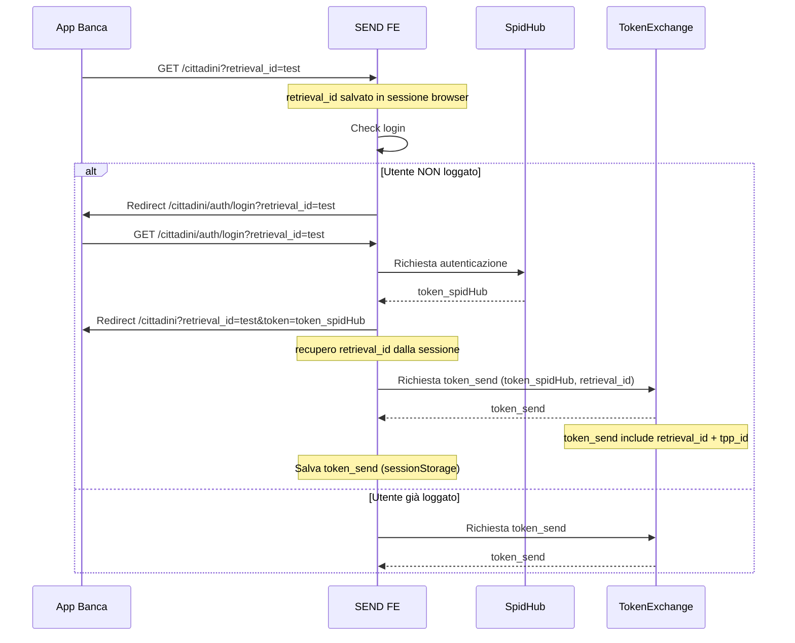
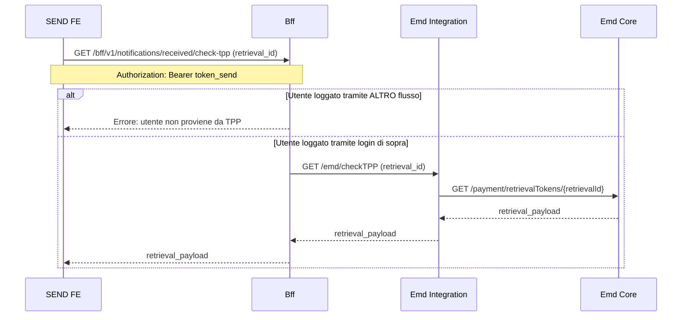
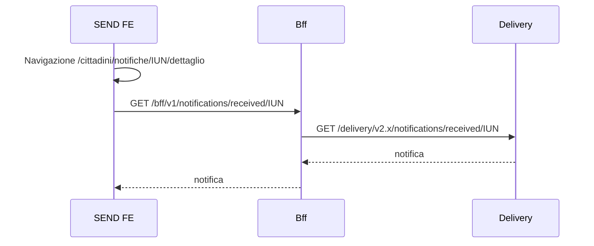

### 1A. Autenticazione (login SPID e token_send)


### 1B. Autorizzazione e recupero retrieval_payload (verifica TPP)


#### Esempio `retrieval_payload`
```json
{
    "retrievalId": "0e4c6629-8753-234s-b0da-1f796999ec2-15038637960920",
    "tppId": "0e3bee29-8753-447c-b0da-1f7965558ec2-1706867960900",
    "deeplink": "https://example.com/deeplink/123e4567-e89b-12d3-a456-426614174000?userId=1234567890&session=abcdef",
    "pspDenomination": "Banca1",
    "originId": "XRUZ-GZAJ-ZUEJ-202407-W-1",
    "isPaymentEnabled": true
}
```

### 2. Accesso al dettaglio notifica (IUN)


