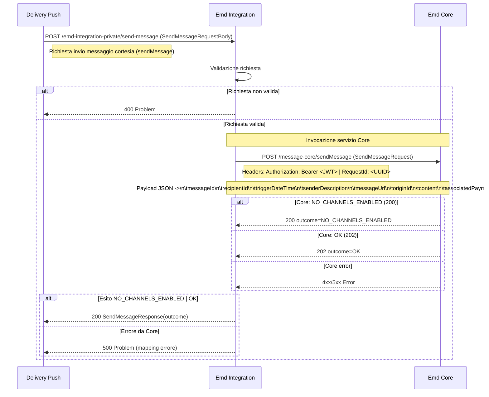

```mermaid
sequenceDiagram
	%% Attori principali
	participant Delivery Push
	participant Emd Integration
	participant Emd Core

	%% Invio messaggio di cortesia (send-message API)
	Delivery Push->>Emd Integration: POST /emd-integration-private/send-message (SendMessageRequestBody)
	Note right of Delivery Push: Richiesta invio messaggio cortesia (sendMessage)
	Emd Integration->>Emd Integration: Validazione richiesta
	alt Richiesta non valida
		Emd Integration-->>Delivery Push: 400 Problem
	else Richiesta valida
		Note over Emd Integration,Emd Core: Invocazione servizio Core
		Emd Integration->>Emd Core: POST /message-core/sendMessage (SendMessageRequest)
		Note right of Emd Integration: Headers: Authorization: Bearer <JWT> | RequestId: <UUID>
		Note over Emd Integration,Emd Core: Payload JSON ->\n\tmessageId\n\trecipientId\n\ttriggerDateTime\n\tsenderDescription\n\tmessageUrl\n\toriginId\n\tcontent\n\tassociatedPayment\n\tchannel=SEND
		alt Core: NO_CHANNELS_ENABLED (200)
			Emd Core-->>Emd Integration: 200 outcome=NO_CHANNELS_ENABLED
		else Core: OK (202)
			Emd Core-->>Emd Integration: 202 outcome=OK
		else Core error
			Emd Core-->>Emd Integration: 4xx/5xx Error
		end
		alt Esito NO_CHANNELS_ENABLED | OK
			Emd Integration-->>Delivery Push: 200 SendMessageResponse(outcome)
		else Errore da Core
			Emd Integration-->>Delivery Push: 500 Problem (mapping errore)
		end
	end
```
