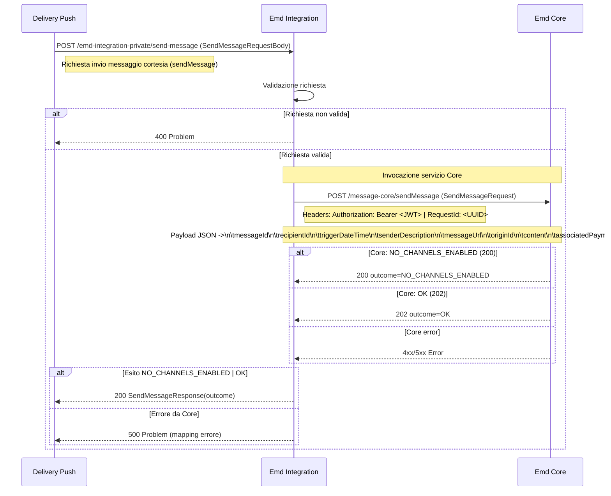

#### Esempio `sendMessageRequest`
```json
{
	"messageId": "8a32fa8a-5036-4b39-8f2e-47d3a6d23f9e",
	"recipientId": "RSSMRA85T10A562S",
	"triggerDateTime": "2024-06-21T12:34:56.000Z",
	"senderDescription": "Comune di Pontecagnano",
	"messageUrl": "http://wwww.google.it",
	"originId": "XRUZ-GZAJ-ZUEJ-202407-W-1",
	"title": "Hai una comunicazione a valore legale su SEND",
	"content": "Ciao,\nhai ricevuto una notifica SEND, cioè una comunicazione a valore legale emessa da un’amministrazione.\n\nPer leggerla e conoscere tutti i dettagli, accedi al sito web di SEND direttamente da questo messaggio entro il 2024-06-21 alle 12:34 eviterai una raccomandata cartacea e i relativi costi.",
	"analogSchedulingDate": "2024-06-26T12:34:56.000Z",
	"workflowType": "ANALOG",
	"associatedPayment": true,
	"channel": "SEND"
}
```
