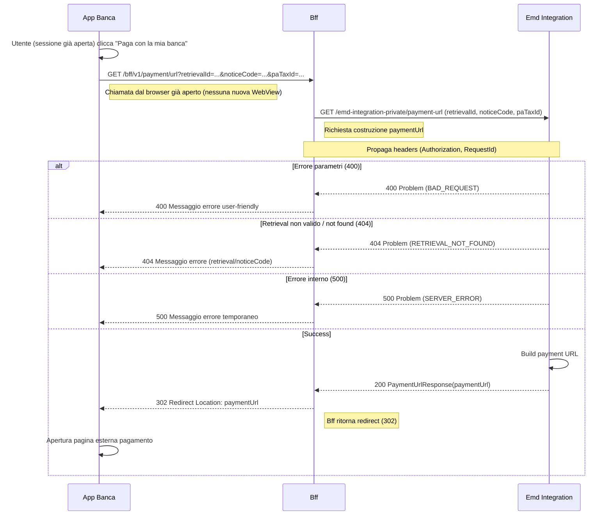

```mermaid


sequenceDiagram
	%% Attori
	participant App Banca
	participant Bff
	participant Emd Integration

	%% Avvio pagamento con sessione browser già attiva
	App Banca->>App Banca: Utente (sessione già aperta) clicca "Paga con la mia banca"
	App Banca->>Bff: GET /bff/v1/payment/url?retrievalId=...&noticeCode=...&paTaxId=...
	Note right of App Banca: Chiamata dal browser già aperto (nessuna nuova WebView)
	Bff->>Emd Integration: GET /emd-integration-private/payment-url (retrievalId, noticeCode, paTaxId)
	Note right of Bff: Richiesta costruzione paymentUrl
	Note over Bff,Emd Integration: Propaga headers (Authorization, RequestId)
	alt Errore parametri (400)
		Emd Integration-->>Bff: 400 Problem (BAD_REQUEST)
		Bff-->>App Banca: 400 Messaggio errore user-friendly
	else Retrieval non valido / not found (404)
		Emd Integration-->>Bff: 404 Problem (RETRIEVAL_NOT_FOUND)
		Bff-->>App Banca: 404 Messaggio errore (retrieval/noticeCode)
	else Errore interno (500)
		Emd Integration-->>Bff: 500 Problem (SERVER_ERROR)
		Bff-->>App Banca: 500 Messaggio errore temporaneo
	else Success
		Emd Integration->>Emd Integration: Build payment URL
		Emd Integration-->>Bff: 200 PaymentUrlResponse(paymentUrl)
		Bff-->>App Banca: 302 Redirect Location: paymentUrl
		Note right of Bff: Bff ritorna redirect (302)
		App Banca->>App Banca: Apertura pagina esterna pagamento
	end
```

> Nota: Gestire eventuali 400 (parametri errati) e 500 (errore interno) mappando messaggi user-friendly lato Bff.
